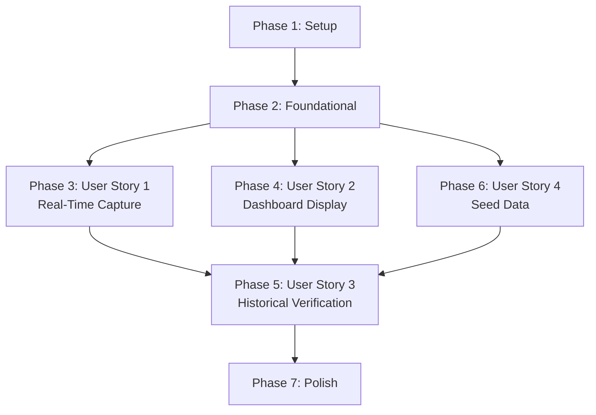

# Tasks: Live Web Vitals Dashboard Integration

**Feature ID**: 004 | **Branch**: `004-database-interactions` | **Generated**: 2025-11-22

## Overview

Break down spec 004 into executable tasks organized by user story for independent implementation and testing. Total estimate: **2-3 hours** (~200 lines of new code).

**Implementation Strategy**: MVP-first with incremental delivery. Each user story is independently testable and demonstrates value.

## Task Summary

- **Setup**: 2 tasks (project scripts)
- **Foundational**: 3 tasks (seed script infrastructure)
- **User Story 1**: 3 tasks (Web Vitals capture + persistence)
- **User Story 2**: 4 tasks (Dashboard real data display)
- **User Story 3**: 2 tasks (Historical data verification)
- **User Story 4**: 3 tasks (Seed data generation - already mostly covered)
- **Polish**: 2 tasks (empty states, error handling)

**Total**: 19 tasks

## Phase 1: Setup

**Goal**: Configure npm scripts and environment for database operations.

**Test Criteria**: Can run `npm run db:seed` and `npm run db:studio` successfully.

### Tasks

- [x] T001 Add package.json scripts: `db:seed`, `db:studio`, `db:push`, `db:reset` in package.json

## Phase 2: Foundational

**Goal**: Create seed script infrastructure that can generate realistic demo data.

**Test Criteria**: Seed script generates 337 metrics with proper distributions and can be run idempotently.

### Tasks

- [x] T002 Create prisma/seed.ts with main() function, Prisma client import, and basic structure
- [x] T003 [P] Implement metric distribution constants (STRATEGY_MEANS, STRATEGY_STDDEVS, METRIC_RANGES) in prisma/seed.ts
- [x] T004 [P] Implement gaussianRandom() and timeFactorMultiplier() helper functions in prisma/seed.ts
- [x] T005 Implement seed data generation loop with progress logging in prisma/seed.ts

## Phase 3: User Story 1 - Real-Time Metrics Capture

**User Story**: As a developer, I want to see my actual browsing performance metrics so I can understand which rendering strategies perform best.

**Goal**: Wire WebVitalsReporter to POST metrics to API when captured.

**Test Criteria**: Browse to `/lab/ssr`, verify metric appears in database via `npm run db:studio`.

### Tasks

- [ ] T006 [US1] Implement determineStrategy() function from URL pathname in components/web-vitals-reporter.tsx
- [ ] T007 [US1] Implement saveMetricToDatabase() async function with fetch POST to /api/web-vitals in components/web-vitals-reporter.tsx
- [ ] T008 [US1] Wire web-vitals callbacks (onLCP, onCLS, onINP, onFID, onTTFB) to call saveMetricToDatabase in components/web-vitals-reporter.tsx

## Phase 4: User Story 2 - Dashboard Real Data Display

**User Story**: As a portfolio viewer, I want to see live database interactions to understand Next.js + Neon integration patterns.

**Goal**: Convert dashboard to Server Component querying real metrics from database.

**Test Criteria**: After running seed, dashboard shows aggregated metrics per strategy (SSG < ISR < CACHE < SSR).

### Tasks

- [ ] T009 [P] [US2] Remove 'use client' directive from app/dashboard/@metrics/page.tsx, change to async function
- [ ] T010 [US2] Import getServerSession and prisma client in app/dashboard/@metrics/page.tsx
- [ ] T011 [US2] Implement database query with groupBy aggregation for last 24h metrics in app/dashboard/@metrics/page.tsx
- [ ] T012 [US2] Transform query results into Map<strategy, Map<metric, avgValue>> and pass to MetricsPanel in app/dashboard/@metrics/page.tsx

## Phase 5: User Story 3 - Historical Metrics Verification

**User Story**: As a performance engineer, I want historical metrics to identify performance regressions and trends.

**Goal**: Verify historical data persists correctly and can be queried efficiently.

**Test Criteria**: Database contains 7 days of seed data, queries filtered by date range return correct results in <100ms.

### Tasks

- [ ] T013 [P] [US3] Verify Prisma indexes exist on web_vitals_metrics table (userId+collectedAt, userId+url+strategy+collectedAt)
- [ ] T014 [US3] Test database query performance with EXPLAIN ANALYZE in npm run db:studio or Neon console

## Phase 6: User Story 4 - Instant Demo Data

**User Story**: As a demo presenter, I want instant seed data to show dashboard populated with realistic metrics.

**Goal**: Ensure seed script generates compelling, realistic demo data quickly.

**Test Criteria**: Run `npm run db:seed` completes in <5s, dashboard shows varied metrics per strategy.

### Tasks

- [ ] T015 [P] [US4] Verify seed script generates correct counts per strategy (SSG: 100, ISR: 87, CACHE: 75, SSR: 75)
- [ ] T016 [US4] Verify seed data has realistic distributions (SSG LCP ~600ms, SSR LCP ~1800ms)
- [ ] T017 [US4] Verify seed script is idempotent (can run multiple times with skipDuplicates or unique timestamp logic)

## Phase 7: Polish & Cross-Cutting Concerns

**Goal**: Handle edge cases and improve user experience.

**Test Criteria**: Dashboard shows empty state for new users, Web Vitals capture errors don't break app.

### Tasks

- [ ] T018 [P] Add empty state UI in app/dashboard/@metrics/page.tsx when no metrics found
- [ ] T019 [P] Add error boundary / try-catch in saveMetricToDatabase() to fail silently in components/web-vitals-reporter.tsx

## Dependencies

### User Story Completion Order



**Critical Path**: Setup → Foundational → User Story 4 (seed) → User Story 2 (dashboard) → Polish

**Recommended Order**:

1. **Phase 1 + 2**: Setup + Foundational (T001-T005)
2. **Phase 6**: User Story 4 (T015-T017) - Get demo data working first
3. **Phase 4**: User Story 2 (T009-T012) - Dashboard displays seed data
4. **Phase 3**: User Story 1 (T006-T008) - Real-time capture
5. **Phase 5**: User Story 3 (T013-T014) - Verification
6. **Phase 7**: Polish (T018-T019) - Edge cases

## Parallel Execution Opportunities

### Phase 2: Foundational (3 tasks can run in parallel after T002)

- T003 (constants) + T004 (helpers) can be implemented simultaneously
- Both are independent utility functions with no shared state
- T005 depends on both T003 and T004 completing

### Phase 3: User Story 1 (2 tasks can run in parallel)

- T006 (determineStrategy) is independent of T007 (saveMetricToDatabase)
- Both can be implemented simultaneously
- T008 depends on both completing

### Phase 4: User Story 2 (2 tasks can run in parallel after T009-T010)

- T011 (query implementation) + T012 (data transformation) are tightly coupled
- But T009 (remove 'use client') and T010 (imports) can be done together

### Phase 5: User Story 3 (both tasks can run in parallel)

- T013 (verify indexes) + T014 (test performance) are independent verification tasks
- Both just confirm existing infrastructure

### Phase 6: User Story 4 (all 3 tasks can run in parallel)

- T015 (verify counts) + T016 (verify distributions) + T017 (verify idempotency)
- All are independent verification checks on the same seed script

### Phase 7: Polish (both tasks can run in parallel)

- T018 (empty state UI) + T019 (error handling) are in different files
- No shared dependencies, can be implemented simultaneously

**Maximum Parallelization Example**:

```bash
# After T002 (seed.ts structure created):
Developer A: T003 (constants) + T004 (helpers) + T005 (generation loop)
Developer B: T006 (determineStrategy) + T007 (saveMetricToDatabase) + T008 (wire callbacks)
Developer C: T009-T012 (dashboard conversion)

# Then verification (all parallel):
Developer A: T013 (indexes)
Developer B: T014 (performance)
Developer C: T015-T017 (seed verification)

# Finally polish (parallel):
Developer A: T018 (empty state)
Developer B: T019 (error handling)
```

## Implementation Strategy

### MVP Scope (Minimum Viable Product)

**Goal**: Get working dashboard with seed data ASAP.

**MVP Tasks** (in order):

1. T001 (setup scripts)
2. T002-T005 (seed script)
3. T009-T012 (dashboard query)
4. T018 (empty state)

**MVP Deliverable**: Run `npm run db:seed`, see populated dashboard. **Estimate: 1.5 hours**

### Incremental Delivery Plan

**Iteration 1** (MVP - 1.5 hours):

- Phase 1: Setup (T001)
- Phase 2: Foundational (T002-T005)
- Phase 4: Dashboard Display (T009-T012)
- Phase 7: Empty state only (T018)

**Iteration 2** (Real-time capture - 30 minutes):

- Phase 3: User Story 1 (T006-T008)
- Phase 7: Error handling (T019)

**Iteration 3** (Verification - 30 minutes):

- Phase 5: User Story 3 (T013-T014)
- Phase 6: User Story 4 (T015-T017)

**Total**: 2.5 hours across 3 iterations

### Testing Strategy

**Per User Story Testing**:

**User Story 1** (Real-time capture):

```bash
# Test flow:
1. npm run dev
2. Login at /login
3. Open DevTools Network tab
4. Browse to /lab/ssr
5. Wait for metrics to capture (LCP fires on tab switch)
6. Verify POST to /api/web-vitals succeeds (200 OK)
7. npm run db:studio
8. Verify new row in web_vitals_metrics with strategy="SSR"
```

**User Story 2** (Dashboard display):

```bash
# Test flow:
1. npm run db:seed (generates 337 metrics)
2. npm run dev
3. Login at /login
4. Navigate to /dashboard
5. Verify 4 strategy cards show metrics
6. Verify SSG shows lower LCP than SSR
7. Check console logs for database query time (<100ms)
```

**User Story 3** (Historical verification):

```bash
# Test flow:
1. npm run db:studio
2. Query: SELECT COUNT(*), MIN(collected_at), MAX(collected_at) FROM web_vitals_metrics
3. Verify 337 rows spanning 7 days
4. Run EXPLAIN ANALYZE on dashboard query
5. Verify index scan used (not seq scan)
```

**User Story 4** (Seed data):

```bash
# Test flow:
1. time npm run db:seed
2. Verify completes in <5s
3. npm run db:studio
4. Check metric distributions (SSG faster than SSR)
5. npm run db:seed (run again)
6. Verify no errors, no duplicates (idempotent)
```

## File Change Summary

### Files to Modify (2)

| File                                 | Lines Changed | Tasks           | Description                            |
| ------------------------------------ | ------------- | --------------- | -------------------------------------- |
| `components/web-vitals-reporter.tsx` | ~40           | T006-T008, T019 | Add API POST call, error handling      |
| `app/dashboard/@metrics/page.tsx`    | ~60           | T009-T012, T018 | Convert to Server Component, add query |

### Files to Create (4)

| File                                   | Lines | Tasks     | Optional?     |
| -------------------------------------- | ----- | --------- | ------------- |
| `prisma/seed.ts`                       | ~200  | T002-T005 | No (required) |
| `package.json`                         | +4    | T001      | No (scripts)  |
| `__tests__/prisma/seed.test.ts`        | ~50   | -         | Yes           |
| `tests/e2e/web-vitals-capture.spec.ts` | ~80   | -         | Yes (backup)  |

### Files Reused (No Changes)

- ✅ `app/api/web-vitals/route.ts` (14 tests passing)
- ✅ `lib/db/web-vitals.ts` (query functions exist)
- ✅ `lib/db/prisma.ts` (Prisma client configured)
- ✅ `prisma/schema.prisma` (table + indexes exist)
- ✅ `components/dashboard/metrics-panel.tsx` (props-driven display)

## Success Metrics

**Completion Checklist**:

- [ ] All 19 tasks marked complete
- [ ] `npm run db:seed` generates 337 metrics in <5s
- [ ] Dashboard shows aggregated metrics per strategy
- [ ] Browse `/lab/ssr` → metric appears in database
- [ ] Dashboard shows empty state for new users
- [ ] Web Vitals capture errors don't crash app
- [ ] Database queries use indexes (verified via EXPLAIN)
- [ ] All 41 existing tests still pass

**Performance Targets**:

- [ ] Dashboard loads with data in <2s
- [ ] `/api/web-vitals` POST responds in <500ms (p95)
- [ ] Database queries complete in <100ms (p95)
- [ ] Seed script completes in <5s

**Quality Gates**:

- [ ] TypeScript compiles with no errors
- [ ] ESLint passes with no warnings
- [ ] Existing tests pass (41 tests from spec 003)
- [ ] Manual testing checklist complete (all 4 user stories)

## Notes

- **No test generation**: Tests are optional per spec. Focus on implementation.
- **Existing infrastructure**: 90% of backend already exists from spec 003. This is primarily wiring.
- **Parallel-friendly**: Most tasks are independent and can be done simultaneously.
- **MVP-focused**: Can ship working dashboard after just 5 tasks (T001-T005, T009-T012, T018).
- **Incremental**: Each phase delivers standalone value and is independently testable.

## References

- [spec.md](./spec.md) - Feature specification
- [plan.md](./plan.md) - Implementation plan
- [data-model.md](./data-model.md) - Database architecture
- [quickstart.md](./quickstart.md) - Setup guide
- [contracts/openapi.yaml](./contracts/openapi.yaml) - API specification
